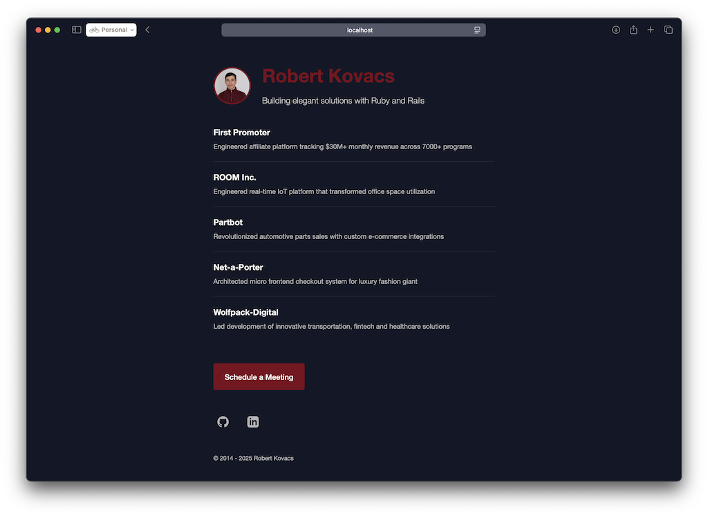

# Robert Kovacs - Ruby Developer Portfolio

This repository contains my personal website showcasing my experience as a Ruby developer and the projects I've worked on.



## 🔗 Live Site

Visit the site: [robikovacs.com](https://robikovacs.com)

## 💼 Featured Projects

- **FirstPromoter.com**: Engineered affiliate platform tracking $30M+ monthly revenue across 7000+ programs
- **Room Inc**: Engineered real-time IoT platform that transformed office space utilization
- **Partbot**: Revolutionized automotive parts sales with AI-powered inventory management
- **Net-a-Porter**: Architected micro frontend checkout system for luxury fashion giant
- **Wolfpack-Digital**: Led development of innovative fintech and healthcare solutions

## 🛠️ Technical Details

This site is built with:

- HTML5/CSS3
- Vanilla JavaScript
- Jekyll for GitHub Pages
- Responsive design with dark/light mode support

## 🚀 Development

### Local Setup

```bash
# Clone the repository
git clone https://github.com/robikovacs/robikovacs.github.io.git
cd robikovacs.github.io

# Install dependencies (if using Jekyll)
bundle install

# Start local server (if using Jekyll)
bundle exec jekyll serve
```

### Structure

- `index.html` - Main content
- `_layouts/default.html` - Main template
- `assets/css/styles.css` - Styling
- `_config.yml` - Jekyll configuration

## 🌙 Features

- **Responsive Design**: Mobile-friendly layout
- **Dark/Light Mode**: Automatically adapts to user's system preferences
- **Minimal Dependencies**: No external libraries or frameworks
- **SEO Optimized**: Meta tags, structured data, and sitemap
- **Fast Loading**: Lightweight implementation

## 📝 License

This project is open source and available under the [MIT License](LICENSE).

## 📅 Timeline

Portfolio active since 2014, showcasing Ruby development expertise.
